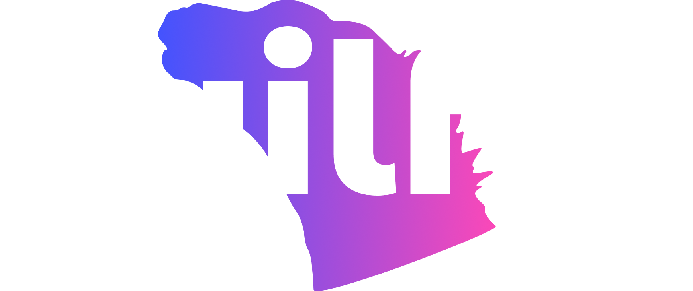

# Sailfin.io - AI-Driven Security for Modern Applications 🔐

Welcome to **Sailfin**, your partner in enhancing application security through AI-driven authentication and authorization solutions. Our mission is to provide intelligent OIDC/OAuth2 platforms that streamline and secure your authentication processes, protecting your applications against evolving threats.

## 🌟 Our Services

We offer a comprehensive suite of security solutions designed to empower your applications with advanced AI capabilities:

- **AI-Powered Authenticationt**: Enhance authentication with adaptive security measures based on user behavior and threat landscapes.
- **AI-Driven Authorization**: Optimize access control with intelligent management of user permissions and roles.
- **Adaptive Multi-Factor Authentication (MFA)**: Implement flexible MFA solutions that adapt to user contexts and risk levels.
- **User Behavior Analytics**: Gain deep insights into user interactions and detect suspicious activities with AI-powered analytics.
- **Anomaly Detection & Security Monitoringt**: Continuously monitor systems for unusual activities and potential threats using AI-driven anomaly detection.
- **Intelligent Consent Management**: Streamline user consent processes with AI-driven tools ensuring compliance and user trust.
- **AI-Assisted Token Management**: Optimize token lifecycle management with AI-enhanced tools for secure and efficient handling.

- **OIDC/OAuth2 Comprehensive Platform**: Manage authentication, authorization, and user sessions effortlessly with our all-in-one AI-enhanced OIDC/OAuth2 platform.

## 🚀 Why Choose Sailfin?

**Sailfin is more than just a security platform.** It's a fusion of cutting-edge AI technologies with robust security protocols, designed to meet the dynamic needs of modern applications. Our solutions offer:

- **Adaptive Security**: Intelligent systems that evolve with emerging threats.

- **Enhanced User Experience**: Secure processes that prioritize usability.

- **Scalability**: Solutions that grow with your business needs.

- **Compliance**: Tools designed to help you adhere to global security regulations.

## 🌍 Explore More

- [Visit our Website](https://sailfin.io)
- [Documentation](link_to_your_docs_here)
- [Get Started with Sailfin](link_to_getting_started_guide_here)

## 🤝 Connect with Us

Follow us on our social media channels:

- [LinkedIn](https://www.linkedin.com/company/sailfin)
- [Instagram](https://www.instagram.com/sailfin.io/)

Join our community and secure your applications with intelligent, AI-driven solutions today!
